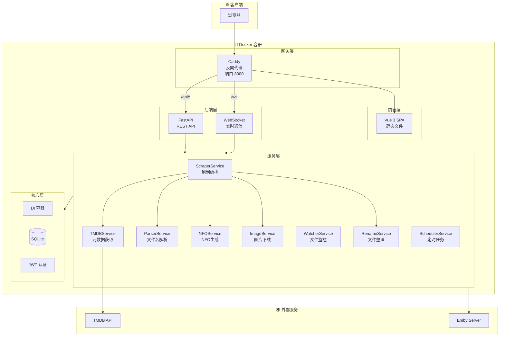
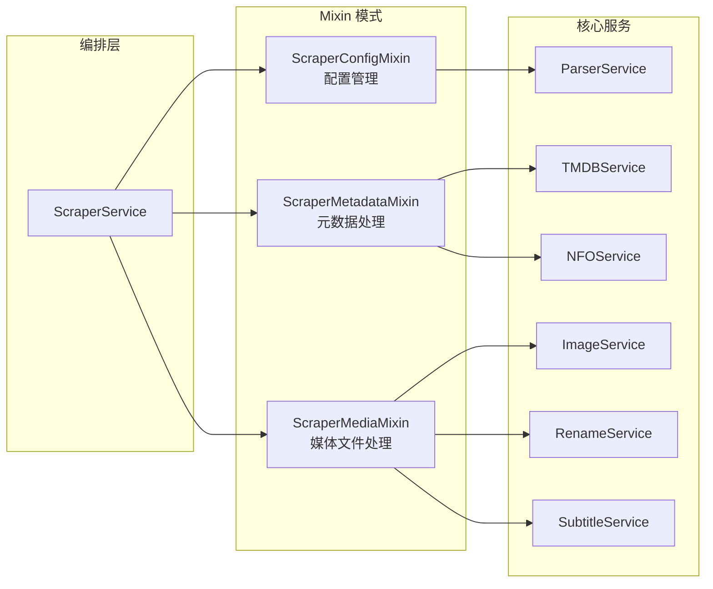
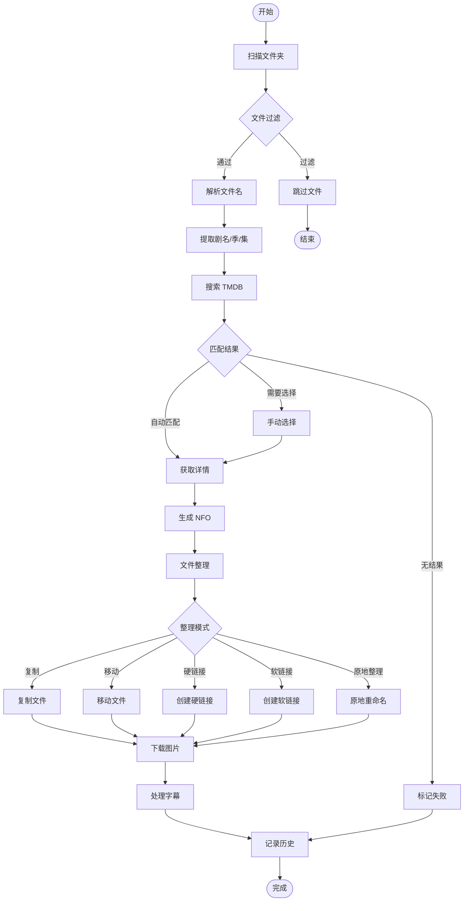
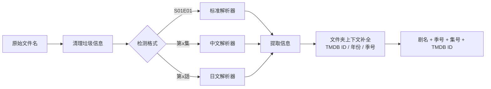
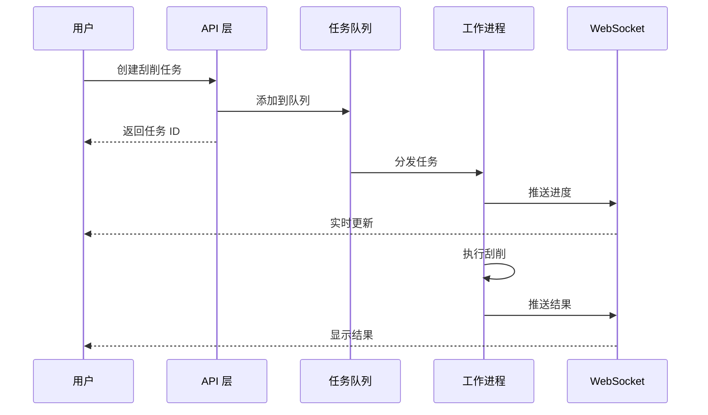
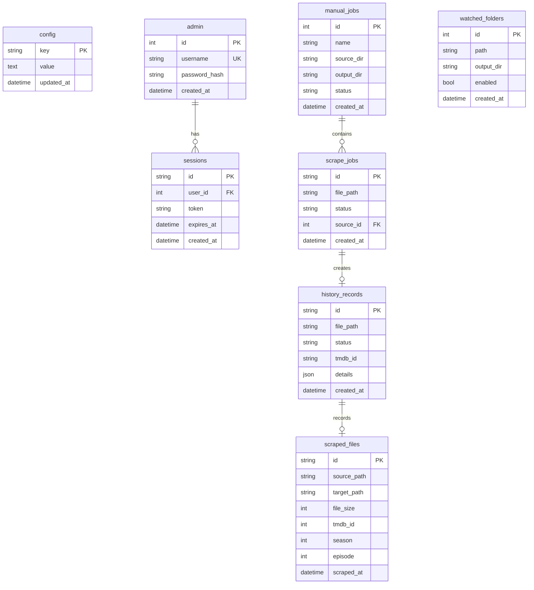

# MHTI - 媒体文件刮削与整理工具

<div align="center">


**自动从 TMDB 获取剧集元数据，智能整理媒体文件**

[功能特性](#-功能特性) •
[快速开始](#-快速开始) •
[系统架构](#-系统架构) •
[API 文档](#-api-端点) •
[开发指南](#-开发指南)

</div>

---

## 📖 项目简介

MHTI 是一个全栈 Web 应用，专为媒体文件管理设计。它能够自动解析视频文件名，从 TMDB 获取元数据，生成 NFO 文件，并智能整理媒体库，完美兼容 Emby/Jellyfin 等媒体服务器。

## ✨ 功能特性

| 功能模块 | 说明 |
|---------|------|
| 🎬 **文件名解析** | 智能解析多种命名格式（标准、中文、日文等） |
| 🗂️ **文件夹上下文解析** | 从父文件夹名自动提取 TMDB ID、年份、季号，有 ID 时跳过搜索直接刮削 |
| 🔍 **TMDB 集成** | 自动搜索匹配，获取剧集/电影元数据 |
| 📝 **NFO 生成** | 生成 Emby/Jellyfin 兼容的 NFO 文件 |
| 📁 **文件整理** | 支持复制/移动/硬链接/软链接/原地整理五种模式 |
| 🏷️ **统一文件夹命名** | 整理后统一为 `名称 (年份) [tmdbid-ID]` 格式 |
| 🖼️ **图片下载** | 自动下载海报、背景图、剧集缩略图 |
| 📺 **字幕关联** | 自动识别并关联同名字幕文件 |
| 👁️ **文件夹监控** | 实时监控文件夹变化，自动触发刮削 |
| 🔗 **Emby 集成** | 媒体库冲突检测，避免重复 |
| 🔐 **安全认证** | JWT 认证，多会话管理 |
| 🌙 **主题切换** | 支持亮色/暗色主题 |

---

## 🏗️ 系统架构

### 整体架构图



### 服务层设计



---

## 🔄 业务流程

### 刮削工作流程



### 文件名解析流程



### 任务队列流程



---

## 📁 项目结构

```
MHTI/
├── 📂 server/                    # Python 后端
│   ├── 📂 api/                   # API 路由层
│   │   ├── auth.py               # 认证接口
│   │   ├── files.py              # 文件操作
│   │   ├── scraper.py            # 刮削接口
│   │   ├── config.py             # 配置管理
│   │   ├── tmdb.py               # TMDB 代理
│   │   ├── watcher.py            # 文件监控
│   │   └── websocket.py          # WebSocket
│   ├── 📂 core/                  # 核心层
│   │   ├── container.py          # 依赖注入容器
│   │   ├── database.py           # 数据库连接
│   │   ├── auth.py               # 认证逻辑
│   │   ├── middleware.py         # 中间件
│   │   └── 📂 db/                # 数据库模块
│   │       ├── connection.py     # 连接池
│   │       └── schema.py         # 表结构
│   ├── 📂 services/              # 业务服务层
│   │   ├── scraper_service.py    # 刮削编排器
│   │   ├── tmdb_service.py       # TMDB 服务
│   │   ├── parser_service.py     # 解析服务
│   │   ├── nfo_service.py        # NFO 生成
│   │   ├── image_service.py      # 图片下载
│   │   ├── rename_service.py     # 文件整理
│   │   ├── watcher_service.py    # 文件监控
│   │   ├── scheduler_service.py  # 定时任务
│   │   └── 📂 parsers/           # 解析器集合
│   │       ├── base.py               # 解析器基类与 ParseContext
│   │       ├── folder_context.py     # 文件夹上下文解析（TMDB ID/年份/季号）
│   │       ├── episode_standard.py
│   │       ├── episode_chinese.py
│   │       └── episode_japanese.py
│   ├── 📂 models/                # 数据模型
│   │   ├── scraper.py            # 刮削模型
│   │   ├── tmdb.py               # TMDB 模型
│   │   ├── file.py               # 文件模型
│   │   └── ...
│   └── 📂 tests/                 # 单元测试
├── 📂 web/                       # Vue.js 前端
│   ├── 📂 src/
│   │   ├── 📂 api/               # API 客户端
│   │   ├── 📂 views/             # 页面视图
│   │   │   ├── HomePage.vue      # 首页
│   │   │   ├── ScanPage.vue      # 手动任务
│   │   │   ├── HistoryPage.vue   # 刮削记录
│   │   │   ├── FilesPage.vue     # 文件管理
│   │   │   └── SettingsPage.vue  # 设置页面
│   │   ├── 📂 components/        # 组件库
│   │   │   ├── 📂 common/        # 通用组件
│   │   │   ├── 📂 layout/        # 布局组件
│   │   │   ├── 📂 scan/          # 扫描组件
│   │   │   ├── 📂 scrape/        # 刮削组件
│   │   │   └── 📂 settings/      # 设置组件
│   │   ├── 📂 stores/            # Pinia 状态
│   │   │   ├── auth.ts           # 认证状态
│   │   │   ├── scraper.ts        # 刮削状态
│   │   │   └── theme.ts          # 主题状态
│   │   ├── 📂 composables/       # 组合式函数
│   │   ├── 📂 utils/             # 工具函数
│   │   └── 📂 router/            # 路由配置
│   └── package.json
├── 📂 data/                      # 数据目录
│   └── scraper.db                # SQLite 数据库
├── .github/
│   └── workflows/
│       ├── ci.yml                # PR 自动测试
│       ├── release.yml           # 标签发布 → Docker Hub + GitHub Release
│       └── docker-publish.yml    # main 分支推送 → GHCR 持续部署
├── docker-compose.yml            # Docker 编排
├── Dockerfile                    # 多阶段构建
├── Caddyfile                     # Caddy 配置
└── pyproject.toml                # Python 依赖
```

---

## 🚀 快速开始

### Docker 部署（推荐）

```bash
# 克隆仓库
git clone https://github.com/your-username/mhti.git
cd mhti

# 启动服务
docker-compose up -d

# 查看日志
docker-compose logs -f

# 访问应用
# 主页: http://localhost:8000
# API 文档: http://localhost:8000/api/docs
```

### 镜像来源

| 镜像 | 标签 | 更新时机 |
|------|------|---------|
| `xiyan520/mhti` (Docker Hub) | `latest`、`1.0.0` 等 | 打版本标签（`v*.*.*`）时发布 |
| `ghcr.io/xiyan520/mhti` (GHCR) | `main`、`sha-XXXXXXX` | 每次推送到 `main` 分支时自动构建 |

### Docker Compose 配置

```yaml
version: '3.8'

services:
  mhti:
    image: xiyan520/mhti:latest
    # 或使用 GHCR 的最新 main 分支构建：
    # image: ghcr.io/xiyan520/mhti:main
    container_name: mhti
    restart: unless-stopped
    ports:
      - "8000:8000"    # 主入口
    volumes:
      - ./data:/app/data              # 数据持久化
      - /path/to/media:/media:ro      # 媒体库（只读）
      - /path/to/output:/output       # 输出目录
    environment:
      - TZ=Asia/Shanghai
      - DATA_DIR=/app/data
```

### 开发模式

```bash
# 后端开发
cd server
python -m venv venv
source venv/bin/activate  # Windows: venv\Scripts\activate
pip install -r requirements.txt
python run_server.py --host 0.0.0.0 --port 8000

# 前端开发
cd web
pnpm install
pnpm dev
```

---

## 🌐 API 端点

### 认证模块 `/api/auth`

| 方法 | 路径 | 说明 |
|------|------|------|
| POST | `/login` | 用户登录 |
| POST | `/logout` | 用户登出 |
| POST | `/register` | 注册账户 |
| POST | `/refresh` | 刷新令牌 |
| GET | `/status` | 认证状态 |
| GET | `/sessions` | 会话列表 |

### 文件模块 `/api/files`

| 方法 | 路径 | 说明 |
|------|------|------|
| POST | `/scan` | 扫描文件夹 |
| GET | `/browse` | 浏览目录 |

### 刮削模块 `/api/scraper`

| 方法 | 路径 | 说明 |
|------|------|------|
| POST | `/scrape` | 执行刮削 |
| POST | `/scrape-by-id` | 按 TMDB ID 刮削 |
| GET | `/status` | 刮削状态 |

### 配置模块 `/api/config`

| 方法 | 路径 | 说明 |
|------|------|------|
| GET/PUT | `/tmdb` | TMDB 配置 |
| GET/PUT | `/proxy` | 代理设置 |
| GET/PUT | `/organize` | 整理配置 |
| GET/PUT | `/download` | 下载设置 |
| GET/PUT | `/nfo` | NFO 设置 |

### 其他模块

| 路径 | 说明 |
|------|------|
| `/api/tmdb/*` | TMDB 代理接口 |
| `/api/emby/*` | Emby 集成 |
| `/api/watcher/*` | 文件夹监控 |
| `/api/history/*` | 历史记录 |
| `/api/scheduler/*` | 定时任务 |
| `/ws` | WebSocket 实时通信 |
| `/health` | 健康检查 |

---

## 🎨 前端页面

| 路径 | 页面 | 功能 |
|------|------|------|
| `/` | 首页 | 统计概览、快捷入口 |
| `/login` | 登录 | 用户认证 |
| `/scan` | 手动任务 | 创建刮削任务 |
| `/history` | 刮削记录 | 查看历史记录 |
| `/files` | 文件管理 | 浏览媒体文件 |
| `/settings` | 设置 | 系统配置 |
| `/security` | 安全设置 | 账户管理 |

---

## 🛠️ 技术栈

### 后端

| 技术 | 版本 | 用途 |
|------|------|------|
| Python | 3.11+ | 运行时 |
| FastAPI | 0.109+ | Web 框架 |
| Uvicorn | 0.27+ | ASGI 服务器 |
| aiosqlite | 0.19+ | 异步 SQLite |
| httpx | 0.27+ | HTTP 客户端 |
| watchdog | 4.0+ | 文件监控 |
| python-jose | 3.3+ | JWT 认证 |
| Pydantic | 2.6+ | 数据验证 |

### 前端

| 技术 | 版本 | 用途 |
|------|------|------|
| Vue | 3.5+ | 前端框架 |
| TypeScript | 5.9+ | 类型系统 |
| Vite | 7+ | 构建工具 |
| Pinia | 3.0+ | 状态管理 |
| Vue Router | 4.6+ | 路由管理 |
| Naive UI | 2.43+ | UI 组件库 |
| Axios | 1.13+ | HTTP 客户端 |

### 部署

| 技术 | 用途 |
|------|------|
| Docker | 容器化 |
| Caddy | 反向代理 |
| SQLite | 数据存储 |

---

## 📊 数据库设计

### 核心表结构



---

## ⚙️ 配置说明

### 整理模式

| 模式 | 说明 | 适用场景 |
|------|------|---------|
| `copy` | 复制文件 | 保留原文件 |
| `move` | 移动文件 | 节省空间 |
| `hardlink` | 硬链接 | 同分区节省空间（推荐） |
| `symlink` | 软链接 | 跨分区引用 |
| `inplace` | 原地整理 | 文件夹已按剧名组织，仅需规范化命名，无需指定目标目录 |

### 文件夹命名格式

整理后的剧集文件夹统一命名为：

```
名称 (年份) [tmdbid-ID]
  └── Season 01
        └── 名称 - S01E01 - 集标题.mkv
```

**支持从父文件夹名识别的格式（用于上层文件夹刮削）：**

| 输入格式 | 示例 |
|---------|------|
| TMDB ID 标签 | `[tmdbid-12345]`、`[tmdb-12345]`、`[tmdbid:12345]` |
| 年份 | `(2025)`、`[2025]` |
| 季度文件夹 | `Season 1`、`Season 01`、`S01` |

### 环境变量

| 变量 | 默认值 | 说明 |
|------|--------|------|
| `DATA_DIR` | `/app/data` | 数据目录 |
| `TZ` | `Asia/Shanghai` | 时区 |

---

## 🧪 测试

```bash
# 运行所有测试
pytest

# 运行覆盖率测试
pytest --cov=server --cov-report=html

# 运行特定测试
pytest server/tests/services/test_parser_service.py -v
```

---

## 📝 开发规范

### 代码风格

- **Python**: Ruff + Black (line-length=100)
- **TypeScript**: ESLint + Prettier
- **类型注解**: 严格模式

### 命名约定

| 语言 | 风格 |
|------|------|
| Python | snake_case |
| TypeScript | camelCase |
| Vue 组件 | PascalCase |

### 提交规范

```
<type>(<scope>): <description>

类型:
- feat: 新功能
- fix: 修复
- docs: 文档
- style: 格式
- refactor: 重构
- test: 测试
- chore: 构建/工具
```

---

## 📄 许可证

本项目采用 MIT 许可证 - 详见 [LICENSE](LICENSE) 文件。

---

## 🤝 贡献

欢迎提交 Issue 和 Pull Request！

1. Fork 本仓库
2. 创建特性分支 (`git checkout -b feature/AmazingFeature`)
3. 提交更改 (`git commit -m 'feat: Add some AmazingFeature'`)
4. 推送到分支 (`git push origin feature/AmazingFeature`)
5. 创建 Pull Request

---

<div align="center">

**Made with ❤️ for media enthusiasts**

</div>
